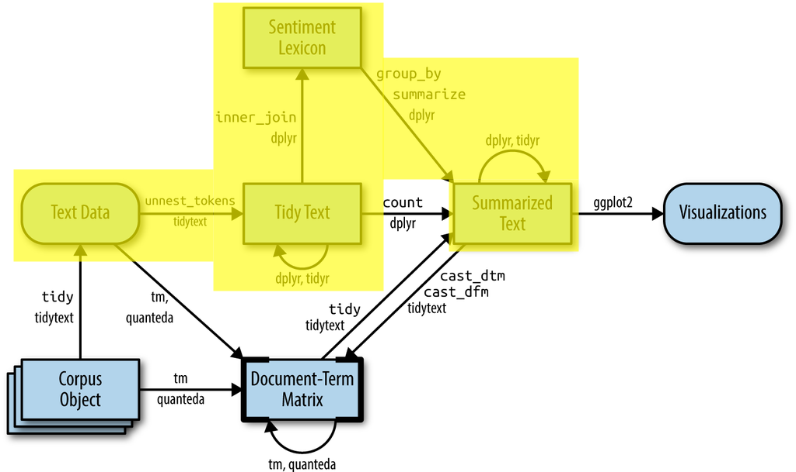

<style type="text/css">
@import url('https://fonts.googleapis.com/css2?family=Lato:wght@300;400&display=swap');

body{ /* Normal  */
  font-size: 13px;
  font-family: 'Lato', sans-serif;
  }
h1.title {
  font-size: 25px;
  color: DarkBlue;
  margin-bottom:5px;
}
h3.subtitle{ /* Subtitle */
  font-size: 20px;
  color: DarkBlue;
  margin-top:0;
}
h1 { /* Header 1 */
  font-size: 20px;
  font-weight: bold;
}
h2 { /* Header 2 */
  font-size: 17px;
  line-height: 1.6;
}
h3 { /* Header 3 */
  font-size: 15px;
  line-height: 1.6;
}
pre { /* Code block - determines code spacing between lines */
  font-size: 13px;
}

</style>
<hr>


```{r setup, include=FALSE}
library(knitr)

knit_engines$set(comment = function(options) {
  if(params$answers) options$code
})

opts_chunk$set(include = params$answers,
                      # echo = params$answers,
                      message = FALSE,
                      warning = FALSE,
                      comment = NA)

# collapse = TRUE  --> see if it is necessary any where
```

Welcome to the third practical on text mining!  

The aim of this practical is to enhance your understanding in sentiment analysis and learn two different ways of performing sentiment analysis.

In this practical, we will focus on the following methods:

 - Dictionary-based methods (*Unsupervised* ).
 <!-- - TF-IDF (Term-frequency-Inverse-Document-Frequency) based methods (*Supervised* ). -->
 - Neural network: using deep learning and word-embeddings.


# Preparation

In this practical, we make use of the following packages:

```{r load_packages, include=TRUE}
library(tm)
library(text2vec)
library(tidyverse)
library(tidytext)
library(ggplot2)
library(textdata) 
library(caret)
library(rpart)
library(rpart.plot)
```

# Text data

We are going to use one data set `movie_review` in this practical:

- IMDB movie reviews is a labeled data set available with the `text2vec` package. This data set consists of 5000 IMDB movie reviews, specially selected for sentiment analysis. The sentiment of the reviews is binary, meaning an IMDB rating < 5 results in a sentiment score of 0, and a rating >=7 has a sentiment score of 1. No individual movie has more than 30 reviews.  

Let's load the data set and convert it to a dataframe.

```{r data, include=TRUE}
# load an example dataset from text2vec
data("movie_review")
movie_review <- as_tibble(movie_review)
head(movie_review)
```

# Dictionary-based (unsupervised)

The `tidytext` package contains 4 general purpose lexicons in the sentiments dataset.

 - `afinn`: list of English words rated for valence between -5 and +5
 - `bing`: list of positive and negative sentiment
 - `nrc`: list of English words and their associations with 8 emotions (anger, fear, anticipation, trust, surprise, sadness, joy, and disgust) and 2 sentiments (negative and positive); binary
 - `loughran`: list of sentiment words for accounting and finance by category (Negative, Positive, Uncertainty, Litigious, Strong Modal, Weak Modal, Constraining)

```{r flowchart, out.width="70%", echo=FALSE, fig.cap = "A flowchart of a typical text analysis that uses tidytext for sentiment analysis.", fig.align='center', include=TRUE}
  

```

### 1. We are going to use `afinn` lexicon in this practical. Using the `get_sentiments` function, load the “afinn” dictionary and store it in an objects called `afinn_sentiments`.

```{r 1}
afinn_sentiments  <- get_sentiments("afinn")
afinn_sentiments
```


### 2. Use `unnest_tokens` function from `tidytext` package to break the text into individual tokens (a process called [tokenization](https://en.wikipedia.org/wiki/Lexical_analysis#Tokenization)) and use `head` function to see its first several rows.

```{r 2}
# tokenize the reviews
tidy_review <- movie_review %>% 
  unnest_tokens(word, review) 

head(tidy_review)
```

### 3. Remove the stop words from the tokenized data frame.
**Hint**: Use `anti_join` function to filter the `stop_words` from the `tidytext` package. 

```{r 3}
tidy_review <- tidy_review %>% 
  # remove stop words
  anti_join(stop_words)

head(tidy_review)
```


### 4. Use `inner_join` function to find a sentiment score for each of the tokenized review words using Afinn lexicon (i.e.,`afinn_sentiments`). 

```{r 4}
review_sentiment <- tidy_review %>%
  inner_join(afinn_sentiments)

head(review_sentiment)
```

### 5. Calculate the average sentiment score for each review. Which one is the most positive review (i.e., has the highest average sentiment score)?

**Hint**: Follow the steps below.    
Step 1. Group the data by `id` using `group_by` function.  
Step 2. Use `summarize` function to compute the average sentiment score.  
Step 3. Use `arrange` function to sort the average sentiment score in descending order. Or, you can use `slice_max` function to select the rows with the highest sentiment score.
```{r 5}
## method 1: use `arrange`
review_sentiment %>%
  # group by review id
  group_by(id) %>% 
  # compute the average sentiment score
  summarize(average_sentiment = mean(value)) %>% 
  # arrange the average sentiment score in descending order
  arrange(desc(average_sentiment))
  

## method 2: use `slice_max`
review_sentiment %>%
  # group by review id
  group_by(id) %>% 
  # compute the average sentiment score
  summarize(average_sentiment = mean(value)) %>% 
  # select the rows with the highest sentiment score (n = 1)
  slice_max(average_sentiment, n = 1)
```

```{comment}
Note that there are 12 reviews that has the highest average sentiment score of 4!
```

### 6. Plot a bar chart of these average sentiment scores across the `id`s. 
**Hint**: Map `id` onto x-axis and average sentiment scores onto y-axis.

```{r 6}
review_sentiment %>%
  # group by review id
  group_by(id) %>% 
  # compute the average sentiment score
  summarize(average_sentiment = mean(value)) %>% 
  # create the coloring variable
  mutate(color = ifelse(average_sentiment > 0, "pos", "neg")) %>%
  # reorder `id` such that average sentiment scores are presented in descending order
  ggplot(aes(x = reorder(id, -average_sentiment), y = average_sentiment, fill = color)) +
  # plot the bar chart using `geom_col`
  geom_col() + labs(x = "id", title = "Average sentiment scores") +
  theme_classic() + theme(axis.text.x=element_blank()) 
```


### 7. Given the computed average sentiment scores, create the `predicted_sentiment` such that *average score higher than zero* is *positive = 1* and *average score lower than or equal to zero* is *negative = 0*. Then, use a [confusion matrix](https://en.wikipedia.org/wiki/Confusion_matrix) to compare this `predicted_sentiment` to the origianl sentiment.

**Hint**: You can use `ifelse` function to create `predicted_sentiment` (i.e., dichotomize the average sentiment score). Then, use `table` function to create the confusion matrix.  
Note that there are some rows removed when we `inner_join` the reviews with Afinn lexicon. You need to filter out those removed rows before comparing the predicted sentiment to original sentiment.
```{r 7}
review_sentiment <- review_sentiment %>%
  group_by(id) %>% 
  summarize(average_sentiment = mean(value)) %>% 
  # Dichotomize average sentiment score to match with the original sentiment scores
  # 1: scores higher than zero; 0: scores lower than or equal to zero
  mutate(predicted_sentiment = ifelse(average_sentiment > 0, 1, 0))

## some rows are removed when we inner_join them.
## we need to filter them out before the comparison.
movie_review <- movie_review %>% 
  filter(id %in% review_sentiment$id)

## not great.... :(
table(true = movie_review$sentiment, predicted = review_sentiment$predicted_sentiment)
```

```{comment}
***HERE SOME MORE EXPLANATIONS ON THE RESULTING CONFUSION MATRIX!***
```

---
# Neural network

In this part of practical, we will show an example of loading pre-trained word vectors and fine-tune them for the purpose of sentiment classification on movie reviews.
Besides the packages loaded above, we need to install the `TensorFlow` and `Keras` packages for R.

The `TensorFlow` package provides code completion and inline help for the [TensorFlow API](https://www.tensorflow.org/api_docs/python/tf/all_symbols) when running within the RStudio IDE. The `TensorFlow` API is composed of a set of Python modules that enable constructing and executing `TensorFlow` graphs.

Install the `TensorFlow` R package from GitHub as follows:

```{r, include=TRUE}
# devtools::install_github("rstudio/tensorflow")
```

Then, use the `install_tensorflow` function to install `TensorFlow`:

```{r, include=TRUE}
library(tensorflow)
# install_tensorflow(package_url = "https://pypi.python.org/packages/b8/d6/af3d52dd52150ec4a6ceb7788bfeb2f62ecb6aa2d1172211c4db39b349a2/tensorflow-1.3.0rc0-cp27-cp27mu-manylinux1_x86_64.whl#md5=1cf77a2360ae2e38dd3578618eacc03b")
```

The provided url just installs the latest TensorFlow version, you can also run this line without providing any argument to the install_tensorflow function.

Finally, you can confirm that the installation succeeded with:

```{r, include=TRUE, collapse=TRUE}
tmr <- tf$constant("Text Mining with R!")
print(tmr)
```

This will provide you with a default installation of `TensorFlow` suitable for getting started with the TensorFlow R package. See the article on installation (https://tensorflow.rstudio.com/installation/) to learn about more advanced options, including installing a version of `TensorFlow` that takes advantage of Nvidia GPUs if you have the correct CUDA libraries installed.

To install the Keras package you first run either of the following lines:
```{r, include=TRUE}
# install.packages("keras")
# devtools::install_github("rstudio/keras")
```

Then, use the `install_keras()` function to install Keras. The `Keras` R interface uses the `TensorFlow` backend engine by default. This will provide you with default CPU-based installations of `Keras` and TensorFlow. If you want a more customized installation, e.g. if you want to take advantage of NVIDIA GPUs, see the documentation for `install_keras()` and the article on installation (https://tensorflow.rstudio.com/installation/).

The ISLR authors also prepared an installation guide to Python, Reticulate and Keras:
https://web.stanford.edu/~hastie/ISLR2/keras-instructions.html


# Sentiment classification with pre-trained word vectors


Now we have `TensorFlow` and `Keras` ready for fine-tuning pre-trained word embeddings for sentiment classification on movie reviews.

Remember to load the `Keras` library: 
```{r, include=TRUE}
library(keras)
```

For sentiment classification with pre-trained word vectors, we want to use [GloVe](https://nlp.stanford.edu/projects/glove/) pretrained word vectors. These word vectors were trained on Wikipedia 2014 and Gigaword 5 containing 6B tokens, 400K vocab, uncased, 50d, 100d, 200d, & 300d vectors. Download the `glove.6B.300d.txt` file manually from the website or use the code below for this purpose.

```{r glove vectors, include = TRUE, cache=TRUE}
# Download Glove vectors if necessary
if (!file.exists('glove.6B.zip')) {
  download.file('https://nlp.stanford.edu/data/glove.6B.zip',destfile = 'glove.6B.zip')
  unzip('glove.6B.zip')
}
```


### 8. Use the code below to load the pre-trained word vectors from the file 'glove.6B.50d.txt'

```{r 8, include = TRUE}
# load glove vectors
vectors <- data.table::fread('data/glove.6B.50d.txt', data.table = F, encoding = 'UTF-8')
colnames(vectors) <- c('word', paste('dim',1:50,sep = '_'))

# convert vectors to dataframe
vectors <- as_tibble(vectors)
```


### 9. To create a learning model using `Keras`, let's first define the hyperparameters. Define the parameters of your `Keras` model with a maximum of 10000 words, maxlen of 60 and word embedding size of 50.

```{r 9}
max_words <- 1e4
maxlen    <- 60
dim_size  <- 50
```


### 10. Use the `text_tokenizer` function from `Keras` and tokenize the movie review data (i.e., `movie_review`) using a maximum of 10000 words. And fit the created object using the `fit_text_tokenizer` function.
**Hint**: `text_tokenizer(num_words = ...) %>% fit_text_tokenizer(review column)` 
```{r 10}
# tokenize the input data and then fit the created object
word_seqs <- text_tokenizer(num_words = max_words) %>%
  fit_text_tokenizer(movie_review$review)
```


### 11. Transform each text into a sequence of integers (word indices) using `texts_to_sequences` and use the `pad_sequences` function to pad the sequences.
**Hint**: `texts_to_sequences(the tokenizer you created above in Q10, review column) %>% pad_sequences(maxlen = ...)`
```{r 11}
# apply tokenizer to the text and get indices instead of words
# later pad the sequence
x_train <- texts_to_sequences(word_seqs, movie_review$review) %>%
  pad_sequences(maxlen = maxlen)
```


### 12. Use the code below to convert the sequence into a dataframe.

```{r 12, include=TRUE}
# unlist word indices
word_indices <- unlist(word_seqs$word_index)

# then place them into data.frame
dic <- data.frame(word = names(word_indices), key = word_indices, stringsAsFactors = FALSE) %>%
  arrange(key) %>% .[1:max_words,]
```


### 13. Use the code below to join the dataframe of sequences (word indices) from the IMDB reviews with GloVe pre-trained word vectors.

```{r 13, include = TRUE}
# join the words with GloVe vectors and
# if a word does not exist in GloVe, then fill NA's with 0
word_embeds <- dic  %>%
  left_join(vectors) %>% .[,3:52] %>% replace(., is.na(.), 0) %>% as.matrix()
```

### 14. Extract the outcome variable from the `sentiment` column in the original dataframe and name it `y_train.`

```{r 14}
# the outcome variable
y_train <- as.matrix(movie_review$sentiment)
```


### 15. Use the `Keras` functional API and create a neural network model as below. Can you describe this model?

```{r 15, include = TRUE}
# Use Keras Functional API
input <- layer_input(shape = list(maxlen), name = "input")

model <- input %>%
  layer_embedding(input_dim = max_words, output_dim = dim_size, input_length = maxlen,
                  # put weights into list and do not allow training
                  weights = list(word_embeds), trainable = FALSE) %>%
  layer_spatial_dropout_1d(rate = 0.2) %>%
  bidirectional(
    layer_gru(units = 80, return_sequences = TRUE)
  )
max_pool <- model %>% layer_global_max_pooling_1d()
ave_pool <- model %>% layer_global_average_pooling_1d()

output <- layer_concatenate(list(ave_pool, max_pool)) %>%
  layer_dense(units = 1, activation = "sigmoid")

model <- keras_model(input, output)

# model summary
model
```


### 16. We can compile the model with an `'adam'` optimizer, and the `binary_crossentropy` loss. You can also choose `accuracy` or `AUC` for the metrics as shown below.

```{r 16, include=TRUE}
# instead of accuracy we can use "AUC" metrics from "tensorflow.keras"
model %>% compile(
  optimizer = "adam", # optimizer = optimizer_rmsprop(),
  loss = "binary_crossentropy",
  metrics = tensorflow::tf$keras$metrics$AUC() # metrics = c('accuracy')
)
```

### 17. Fit the model with 10 epochs (iterations), batch_size = 32, and validation_split = 0.2. Check the training performance versus the validation performance.
**Hint**: You can use `model %>% keras::fit(x_train, y_train,epochs = ..., batch_size = ..., validation_split = ...)`.  Then, plot the resulting object using `plot` function.
```{r 17}
history <- model %>% keras::fit(
  x_train, y_train,
  epochs = 10,
  batch_size = 32,
  validation_split = 0.2
)

plot(history)
```

### 18. See the two network models below. Compare those two and to try to think of ways to improve the AUC of each model.
```{r 18-1, include=TRUE}
## Model 1
input <- layer_input(shape = list(maxlen), name = "input")

output <- input %>%
  layer_embedding(input_dim = max_words, output_dim = dim_size, input_length = maxlen,
                  weights = list(word_embeds), trainable = FALSE) %>%
  layer_lstm(units = 80, return_sequences = TRUE)                 %>% 
  layer_flatten()                                                 %>%
  layer_dense(units = 1, activation = "sigmoid")

model <- keras_model(input, output)

summary(model)
```

```{r 18-2, include=TRUE}
## Model 2
input <- layer_input(shape = list(maxlen), name = "input")

output <- input %>%
  layer_embedding(input_dim = max_words, output_dim = dim_size, input_length = maxlen,
                  weights = list(word_embeds), trainable = FALSE) %>%
  layer_lstm(units = 80, return_sequences = TRUE)                 %>% 
  layer_flatten()                                                 %>%
  layer_dense(units = 10, activation = "relu")                    %>% 
  layer_dense(units = 1, activation = "sigmoid")

model <- keras_model(input, output)

summary(model)
```

